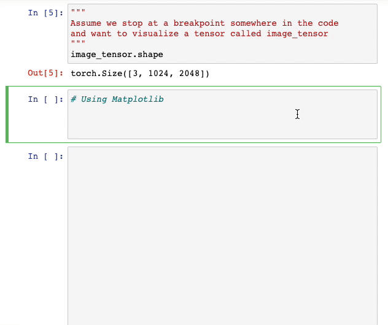
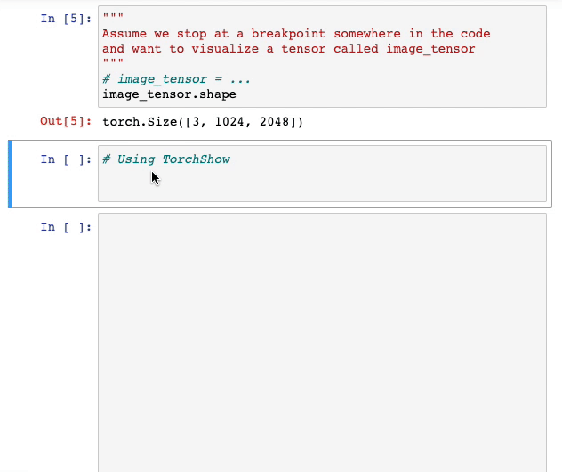
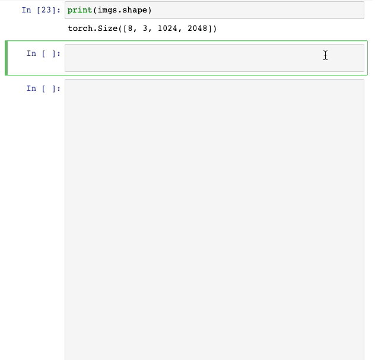
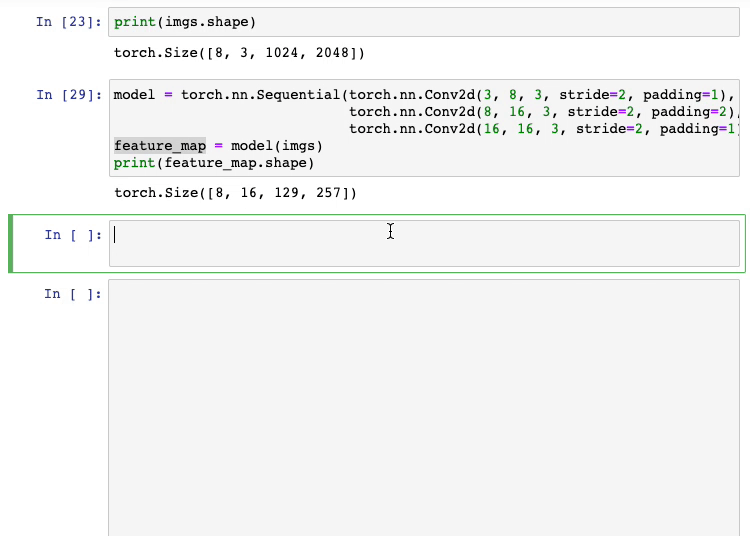
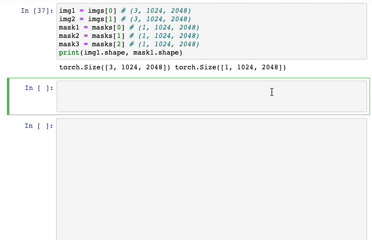
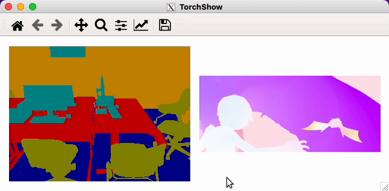
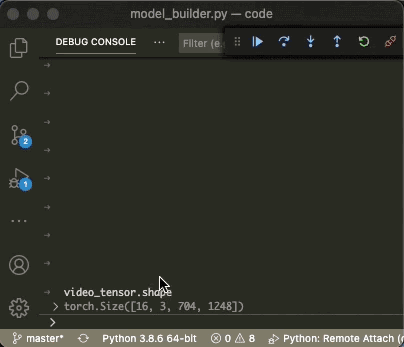
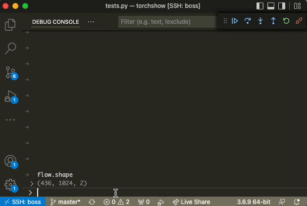
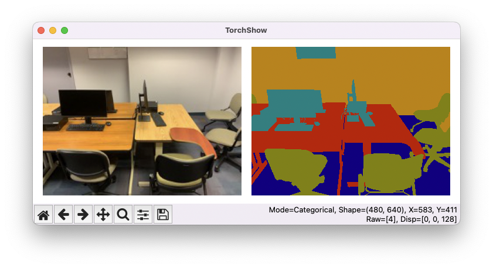
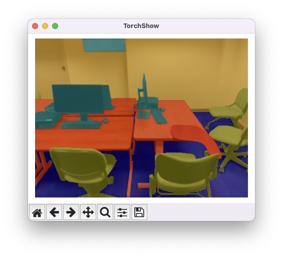

<div align="center">


[](https://badge.fury.io/py/torchshow)
[](https://pepy.tech/project/torchshow)


</div>

----

Torchshow visualizes your data in one line of code. It is designed to help debugging Computer Vision project.

Torchshow automatically infers the type of a tensor such as RGB images, grayscale images, binary masks, categorical masks (automatically apply color palette), etc. and perform necessary unnormalization if needed. 

**Supported Type:**

- [x] RGB Images
- [x] Grayscale Images
- [x] Binary Mask
- [x] Categorical Mask (Integer Labels)
- [x] Multiple Images
- [x] Videos
- [x] Multiple Videos
- [x] Optical Flows (powered by [flow_vis](https://github.com/tomrunia/OpticalFlow_Visualization))


## What's New in v0.5.1
- Fix `np.int` depreciation issues.
- Allow specifying nrows and ncols when visualizing a list of tensors.
- Fix unexpected white spaces when saving figures.

See the complete [changelogs](changelogs.md).


## Installation
Install from [PyPI](https://pypi.org/project/torchshow/):

```bash
pip install torchshow
```

Alternatively, you can install directly from this repo to test the latest features.

```bash
pip install git+https://github.com/xwying/torchshow.git@master
```


## Basic Usage

The usage of TorchShow is extremely simple. Simply import the package and visualize your data in one line:

```python
import torchshow as ts
ts.show(tensor)
```

If you work on a headless server without display. You can use `ts.save(tensor)` command (since version 0.3.2).

```python
import torchshow as ts
ts.save(tensor) # Figure will be saved under ./_torchshow/***.png
ts.save(tensor, './vis/test.jpg') # You can specify the save path.
```

## API References

Please check [this page](./API.md) for detailed API references.


## Examples

### Table of Contents
- [Visualizing Image Tensor](#1-visualizing-image-tensor)
- [Visualizing Mask Tensors](#2-visualizing-mask-tensors)
- [Visualizing Batch of Tensors](#3-visualizing-batch-of-tensors)
- [Visualizing Channels in Feature Maps](#4-visualizing-feature-maps)
- [Visualizing Multiple Tensors with Custom Layout.](#5-visualizing-multiple-tensors-with-custom-layout)
- [Examine the pixel with rich information.](#6-examine-the-pixel-with-richer-information)
- [Visualizing Tensors as Video Clip](#7-visualizing-tensors-as-video-clip)
- [Display Video Animation in Jupyter Notebook](#8-display-video-animation-in-jupyter-notebook)
- [Visualizing Optical Flows](#9-visualizing-optical-flows)
- [Change Channel Order (RGB/BGR)](#10-change-channel-order-rgbbgr)
- [Change Unnormalization Presets](#11-change-unnormalization-presets)
- [Overlay Visualizations](#12-overlay-visualizations)

### 1. Visualizing Image Tensor
Visualizing an image-like tensor is not difficult but could be very cumbersome. You usually need to convert the tensor to numpy array with proper shapes. In many cases images were normalized during dataloader, which means that you have to unnormalize it so it can be displayed correctly.

If you need to frequently verify what your tensors look like, TorchShow is a very helpful tool. 

Using Matplotlib             |  Using TorchShow
:-------------------------:|:-------------------------:
  |  
|The image tensor has been normalized so Matlotlib cannot display it correctly. | TorchShow does the conversion automatically.|

### 2. Visualizing Mask Tensors
For projects related to Semantic Segmentation or Instance Segmentation, we often need to visualize mask tensors -- either ground truth annotations or model's prediction. This can be easily done using TorchShow.

Using Matplotlib             |  Using TorchShow
:-------------------------:|:-------------------------:
  |  
| Different instances have same colors. Some categories are missing. | TorchShow automatically apply color palletes during visualization.|

### 3. Visualizing Batch of Tensors
When the tensor is a batch of images, TorchShow will automatically create grid layout to visualize them. It is also possible to manually control the number of rows and columns.



### 4. Visualizing Feature Maps
If the input tensor has more than 3 channels, TorchShow will visualize each of the channel similar to batch visualization. This is useful to visualize a feature map.



### 5. Visualizing Multiple Tensors with Custom Layout.
TorchShow has more flexibility to visualize multiple tensor using a custom layout.

To control the layout, put the tensors in list of list as an 2D array. The following example will create a 2 x 3 grid layout.

```
ts.show([[tensor1, tensor2, tensor3],
         [tensor4, tensor5, tensor6]])
```

It is worth mentioning that there is no need to fill up all the places in the grid. The following example visualizes 5 tensors in a 2 x 3 grid layout.

```
ts.show([[tensor1, tensor2],
         [tensor3, tensor4, tensor5]])
```




### 6. Examine the pixel with richer information.
Since `v0.4.1`, TorchShow allows you to get richer information from a pixel you are interested by simply hovering your mouse over that pixel. This is very helpful for some types of tensors such as Categorical Mask and Optical Flows. 

Currently, Torchshow displays the following information: 

- `Mode`: Visualization Mode.
- `Shape`: Shape of the tensor.
- `X`, `Y`: The pixel location of the mouse cursor.
- `Raw`: The raw tensor value at (X, Y).
- `Disp`: The display value at (X, Y).



**Note: if the information is not showing on the status bar, try to resize the window and make it wider.**

This feature can be turned off by `ts.show_rich_info(False)`.


### 7. Visualizing Tensors as Video Clip
Tensors can be visualized as video clips, which very helpful if the tensor is a sequence of frames. This can be done using `show_video` function.

```python
ts.show_video(video_tensor)
```



It is also possible to visualize multiple videos in a custom grid layout.


### 8. Display Video Animation in Jupyter Notebook
TorchShow visualizes video clips as an `matplotlib.func_animation` object and may not display in a notebook by default. The following example shows a simple trick to display it.

```python
import torchshow as ts
from IPython.display import HTML

ani = ts.show_video(video_tensor)
HTML(ani.to_jshtml())
```

### 9. Visualizing Optical Flows
TorchShow support visualizing optical flow (powered by [flow_vis](https://github.com/tomrunia/OpticalFlow_Visualization)). Below is a demostration using a VSCode debugger remotely attached to a SSH server (with X-server configured). Running in a Jupyter Notebook is also supported.



### 10. Change Channel Order (RGB/BGR)
By default tensorflow visualize image tensor in the RGB mode, you can switch the setting to BGR in case you are using opencv to load the image.
```python
ts.set_color_mode('bgr')
```

### 11. Change Unnormalization Presets
The image tensor may have been preprocessed with a normalization function. If not specified, torchshow will automatically rescale it to 0-1. 


To change the preset to imagenet normalization. Use the following code.
```python
ts.show(tensor, unnormalize='imagenet')
```

To use a customize mean and std value, use the following command. 
```python
ts.set_image_mean([0., 0., 0.])
ts.set_image_std([1., 1., 1.])
```
Note that once this is set, torchshow will use this value for the following visualization. This is useful because usually only a single normalization preset will be used for the entire project.


### 12. Overlay Visualizations
In Computer Vision project there are many times we will be dealing with different representations of the scene, including but not limited to RGB image, depth image, infrared image, semantic mask, instance mask, etc. Sometimes it will be very helpful to overlay these different data for visualization. Since `v0.5.0`, TorchShow provides a very useful API `ts.overlay()` for this purpose.

In the below example we have an RGB image and its corresponding semantic mask. Let's first check what they look like using TorchShow.

```python
import torchshow as ts
ts.show(["example_rgb.jpg", "example_category_mask.png"])
```



Now I would like to overlay the mask on top of the RGB image to gain more insights, with TorchShow this can be easily done with one line of code.

```python
import torchshow as ts
ts.overlay(["example_rgb.jpg", "example_category_mask.png"], alpha=[1, 0.6])
```

