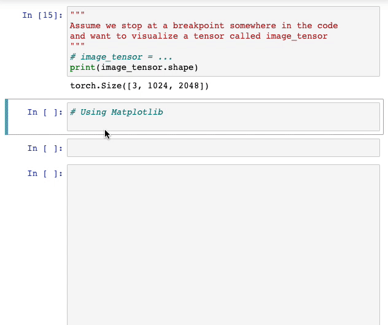
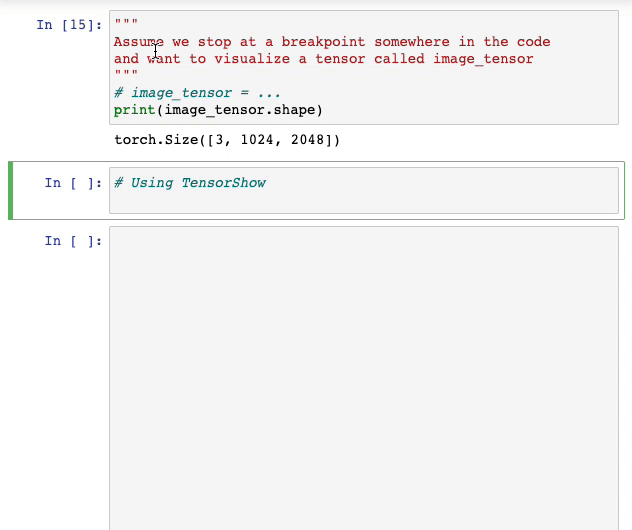
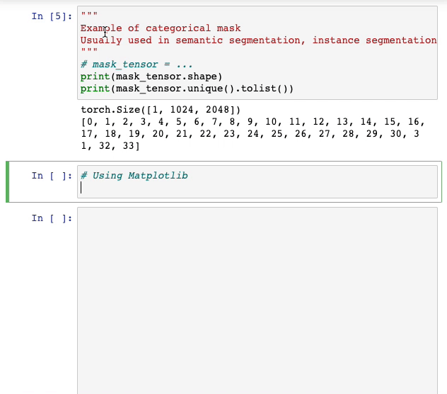
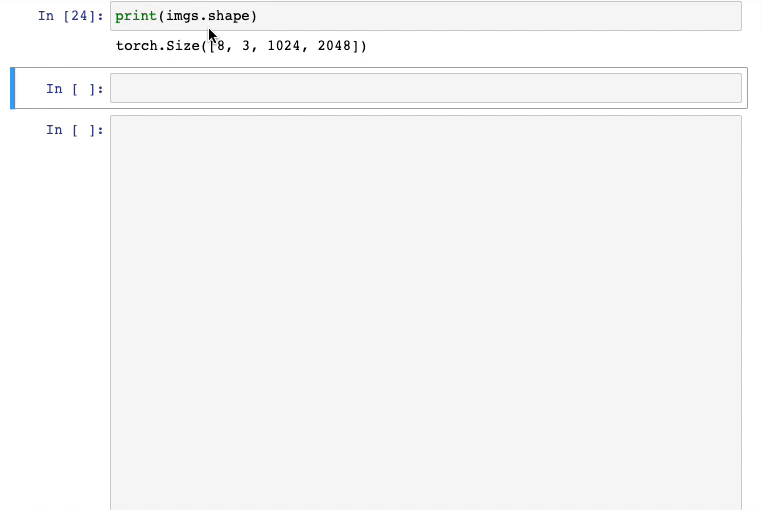
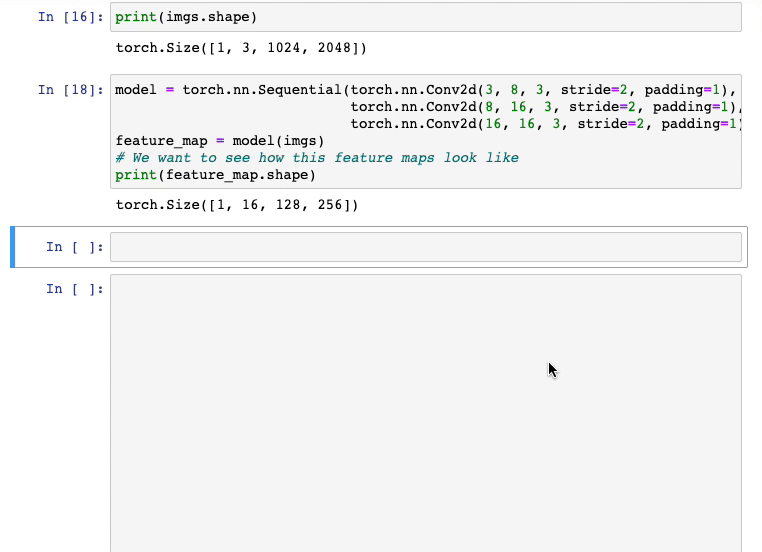
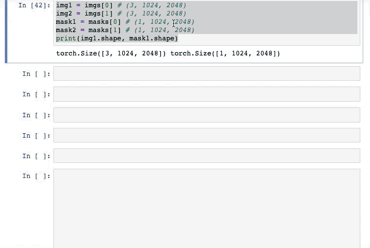
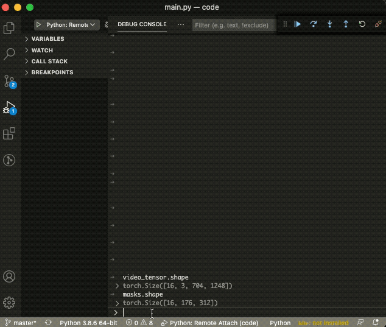

# TensorShow Tutorial

## Basic Usage
```python
import tensorshow as ts
ts.show(tensor)
```

## Visualizing Image Tensor
Visualizing an image-like tensor is not difficult but could be very tedious. You usually need to convert the tensor to numpy array with proper shapes. In many cases images were normalized during dataloader, which means that you have to unnormalize it so it can be displayed correctly.

If you need to frequently verify how your image tensors look like, TensorShow is a very helpful tool. 

Using Matplotlib             |  Using TensorShow
:-------------------------:|:-------------------------:
  |  
|The image tensor has been normalized so matplotlib cannot display it correctly. | TensorShow does the conversion automatically.|

## Visualizing Mask Annotations
For projects related to Semantic Segmentation or Instance Segmentation, we usually need to visualize the mask tensor -- either from ground truth or from model's prediction. This can be easily done using TensorShow.

Using Matplotlib             |  Using TensorShow
:-------------------------:|:-------------------------:
  |  
|The default color can hardly differentia different categories or instances. | TensorShow automatically apply color palletes during visualization.|

## Visualizing Batch of Tensors
When the tensor is a batch of images, TensorShow will automatically create grid layout to visualize them. It is also possible to manually control the number of rows and columns.



## Visualizing Feature Maps
If the input tensor has more than 3 channels, TensorShow will visualize each of the channel similar to batch visualization. This is useful to visualize a feature map.



## Visualizing Multiple Tensors with Custom Layout.
TensorShow has more flexibility to visualize multiple tensor using a custom layout.

To control the layout, put the tensors in list of list as an 2D array. The following example will create a 2 x 3 grid layout.

```
ts.show([[tensor1, tensor2, tensor3],
         [tensor4, tensor5, tensor6]])
```

It is worth mentioning that it is necessary to fill up all the places in the grid. The following example visualizes 5 tensors in a 2 x 3 grid layout.

```
ts.show([[tensor1, tensor2],
         [tensor3, tensor4, tensor5]])
```



## Visualizing Tensors as Video Clip
Tensors can be visualized as video clips, which very helpful if the tensor is a sequence of frames. This can be done using `show_video` function.

```python
ts.show_video(video_tensor)
```


It is also possible to visualize multiple videos in a custom grid layout.



## Display Video Animation in Jupyter Notebook
TensorShow visualizes video clips as an `matplotlib.func_animation` object and may not be able to directly displayed in a notebook. The following example shows a simple trick to display it.

```python
import tensorshow as ts
from IPython.display import HTML

ani = ts.show_video(video_tensor)
HTML(ani.to_jshtml())
```

